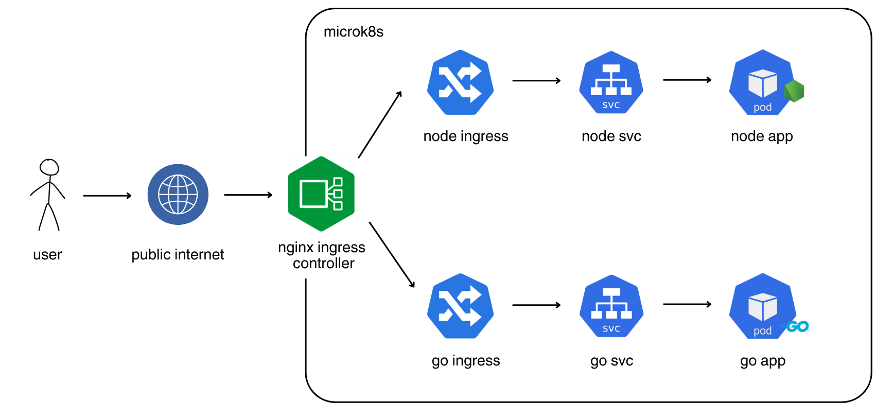

# SRE Tech Assessment

This repository contains code and resources for the SRE Tech Assessment by Fitri Annisa.


## User Flow Diagram


## Contents
- `.github`: Contains GitHub Workflow configuration for CI/CD. This includes YAML files defining the actions to be performed for each step of the CI/CD process.
- `go-helm-chart`: Contains the Helm chart for deploying your Golang application.
- `golang`: Contains a simple "Hello world" Golang application.
- `node-helm-chart`: Contains the Helm chart for deploying your Node.js application.
- `nodejs`: Contains a simple "Hello world" Node.js application.

## Tech Stack
- [microk8s](https://microk8s.io/) deployed on Virtual Private Server
- [Helm for Kubernetes Manifest](https://helm.sh/)
- [Github Actions for CI/CD](https://docs.github.com/en/actions)
- [Docker Hub](https://hub.docker.com/)

## CI/CD Features
- Unit testing for Golang and NodeJS app
- Build and push Docker image to Docker Hub
- Deploy application to microk8s using Helm Chart 

## Endpoint
**Golang**

| endpoint     | url                              | method     |
| :---:        | :---:                            | :---:      |
| /            | go.fitri-annisa.my.id  | GET        |

**Nodejs**

| endpoint     | url                                         | method     |
| :---:        | :---:                                       | :---:      |
| /            | node.fitri-annisa.my.id  | GET        |

For endpoint testing, you can use the curl command to send HTTP requests to the endpoint. Here's a basic example of how you can use curl to test an endpoint:

**Golang**
```sh
curl http://go.fitri-annisa.my.id/
```

**NodeJS**
```sh
curl http://node.fitri-annisa.my.id/
```
